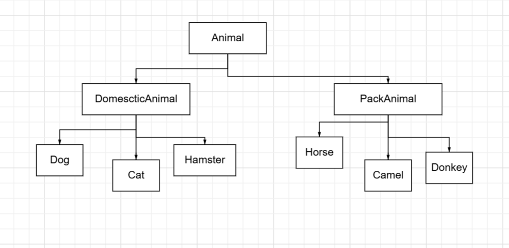

# Итоговая контрольная работа


## Задание
 1. Используя команду cat в терминале операционной системы Linux, создать
 два файла Домашние животные(заполнив файл собаками,кошками,
 хомяками) и Вьючные животными (заполнив файл Лошадьми,верблюдамии
 ослы), а затем объединить их. Просмотреть содержимое созданного файла.
 Переименовать файл, дав ему новое имя(Друзьячеловека).
 - `echo -e "Dog\nCat\nHamster" > DomesticAnimals.txt`
 - `echo -e "Horse\nCamel\nDonkey" > PackAnimals.txt`
 - `cat DomesticAnimals.txt PackAnimals.txt > FriendsOfHuman.txt`
 - `cat FriendsOfHuman.txt`
 - `mv FriendsOfHuman.txt HumanFriends.txt`

 2. Создать директорию, переместить файл туда.
 - `mkdir AnimalDirectory`
 - `mv HumanFriends.txt AnimalDirectory/`

 3. Подключить дополнительный репозиторий MySQL. Установить любой пакет
 из этого репозитория.
 - `sudo apt update`
 - `sudo apt install mysql-server`
 - `sudo apt install mysql-client`

 4. Установить и удалить deb-пакет с помощью dpkg.
 - `sudo dpkg -i code_amd64.deb`
 - `sudo dpkg --remove code`
 5. Выложить историю команд в терминале ubuntu
 6. Нарисовать диаграмму, в которой есть класс родительский класс, домашние
 животные и вьючные животные, в составы которых в случае домашних
 животных войдут классы: собаки, кошки, хомяки, а в класс вьючные животные
 войдут: Лошади, верблюды и ослы.


 7. В подключенном MySQL репозитории создать базу данных “Друзья
 человека”
 - `CREATE DATABASE FriendsOfHuman`
 8. Создать таблицы с иерархией из диаграммы в БД
 - `CREATE TABLE DomesticAnimals (`
   `id INT AUTO_INCREMENT PRIMARY KEY,`
   `name VARCHAR(50),`
   `birth_date DATE,`
   `commands TEXT`
`);`

 - `CREATE TABLE PackAnimals (`
   `id INT AUTO_INCREMENT PRIMARY KEY,`
   `name VARCHAR(50),`
   `birth_date DATE,`
   `commands TEXT`
`);`
 
 9. Заполнить низкоуровневые таблицы именами(животных), командами
 которые они выполняют и датами рождения
 - `INSERT INTO DomesticAnimals (name, birth_date, commands)` 
 `VALUES ('Dog', '2021-05-10', 'Sit, Stay'),`
    `('Cat', '2022-12-12', 'Eat, Sleep'),`
    `('Hamster', '2022-01-01', 'Eat, Run');`

 - `INSERT INTO PackAnimals (name, birth_date, commands)` 
 `VALUES ('Horse', '2020-06-15', 'Run, Jump'),`
 `('Camel', '2020-02-02', 'Run, Drink')`
 `('Donkey', '2022-07-17', 'Run, Eat');` 

 10. Удалив из таблицы верблюдов,т.к. верблюдов решили перевезти в другой
 питомник на зимовку. Объединить таблицы лошади и ослы в одну таблицу.
 - `DELETE FROM PackAnimals WHERE name = 'Camel';`
 - `CREATE TABLE HorsesAndDonkeys AS`
 `SELECT * FROM PackAnimals WHERE name IN ('Horse', 'Donkey');`

 11. Создать новую таблицу “молодые животные” в которую попадут все
 животные старше 1 года,но младше 3 лет и вотдельном столбце с точностью
 до месяца подсчитать возраст животных в новой таблице
 - `CREATE TABLE YoungAnimals AS`
 `SELECT name, birth_date, TIMESTAMPDIFF(MONTH, birth_date, CURDATE()) AS age_in_months`
 `FROM DomesticAnimals`
 `WHERE TIMESTAMPDIFF(YEAR, birth_date, CURDATE()) BETWEEN 1 AND 3`
 `UNION ALL`
 `SELECT name, birth_date, TIMESTAMPDIFF(MONTH, birth_date, CURDATE()) AS age_in_months`
 `FROM PackAnimals`
 `WHERE TIMESTAMPDIFF(YEAR, birth_date, CURDATE()) BETWEEN 1 AND 3;`

 12. Объединить все таблицы водну, при этом сохраняя поля, указывающие на
 прошлую принадлежность к старым таблицам.
 -`CREATE TABLE AllAnimals AS`
  `SELECT name, birth_date, commands FROM DomesticAnimals`
  `UNION`
  `SELECT name, birth_date, commands FROM PackAnimals;`
 - `Результат в папке sql в корне проекта` 
 13. Создать класс с Инкапсуляцией методов и наследованием по диаграмме.
 14. Написать программу, имитирующую работу реестра домашнихживотных.
 В программе должен быть реализован следующий функционал:
 14.1 Завести новое животное
 14.2 определять животное в правильныйкласс
 14.3 увидеть список команд, которое выполняет животное
 14.4 обучить животное новымкомандам
 14.5 Реализовать навигацию по меню
 15. Создайте класс Счетчик, у которого есть метод add(), увеличивающий
 значение внутренней int переменной на 1 принажатие “Завести новое
 животное” Сделайте так, чтобы с объектом такого типа можно было работать в
 блоке try-with-resources. Нужно бросить исключение, если работа с объектом
 типа счетчик была невресурсном try и/или ресурс остался открыт. Значение
 считать в ресурсе try, если при заведения животного заполнены все поля

# Animal Registry System
## Описание
Это приложение на Java, которое позволяет пользователям управлять коллекцией животных. Пользователи могут добавлять животных, просматривать их список, обучать новым командам и просматривать команды. В этом приложении есть счетчик для отслеживания количества добавленных животных.
## Возможности
- Добавление новых животных (как домашних, так и вьючных)
- Просмотр всех зарегистрированных животных
- Обучение животных новым командам
- Просмотр команд конкретного животного
- Подсчет общего количества добавленных животных
## Установка
### Предварительные требования

Убедитесь, что у вас установлено следующее:

- Java Development Kit (JDK) 8 или выше

### Инструкции по установке

1. Клонируйте репозиторий:
    ```bash
    git clone https://github.com/AzaS31/ControlWork.git
    cd ControlWork/src
    ```
2. Скомпилируйте проект:
    ```bash
    javac Main.java
    ```
3. Запустите приложение:
    ```bash
    java Main
    ```

## Использование
1. После запуска приложения вам будет предложено меню с опциями для добавления животного, просмотра животных, просмотра команд, обучения новым командам или выхода.
2. Следуйте подсказкам, чтобы ввести данные о животном.
3. Используйте предложенные опции для навигации по приложению.

### Пример
- Чтобы добавить новое домашнее животное, выберите опцию 1, затем введите имя животного, дату рождения и тип (например, Cat).
- После добавления животных вы можете просмотреть их список, выбрав опцию 2.

 